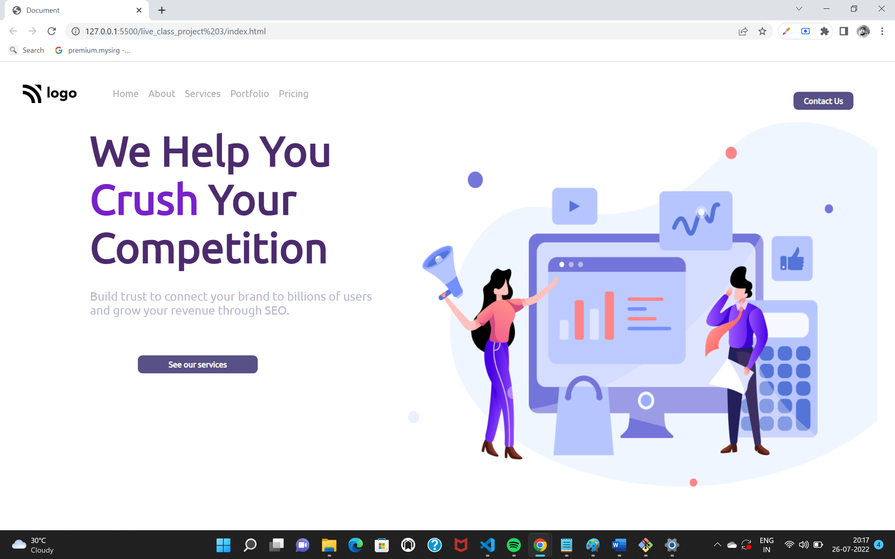

# Hii welcome to Rohan Kaushik's project

I am very Excited to tell that i have successfully completed my third project and this time I am getting more confidence. 

## What I have learnt in this Project
  
- Now I am more comfortable with the some alignments 
- Here I tried to use vast types of selectors so that I can't stuck easily in selecting elements

## Time Spent on this project

- I am so excited to do more projects because I my time is decreasing day by day and this project tooks me 2 hrs only to do so...

